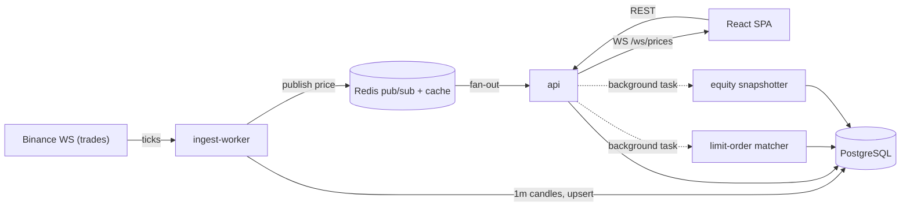

# Condor

A web-based **paper trading terminal** — real-time market data, a simulated
execution engine, an options strategy lab, and a portfolio risk dashboard.

[](https://github.com/angelarroyod/condor/actions/workflows/backend.yml)
[](https://github.com/angelarroyod/condor/actions/workflows/frontend.yml)
[](backend/pyproject.toml)
[](web/tsconfig.app.json)
[](LICENSE)

> Dark, professional trading-terminal aesthetic. Runs entirely on **free data
> sources** — no paid API keys. `docker compose up` and it streams live.

> 📸 **Add a hero here.** Run the stack (below) and drop a GIF/screenshot at
> `docs/screenshots/terminal.png` — the live watchlist + streaming candlestick
> chart make the strongest first impression. (See [docs/screenshots](docs/screenshots).)

## What it does

- **Live market data** — the ingest worker subscribes to Binance's public
  WebSocket (`BTCUSDT`, `ETHUSDT`, `SOLUSDT`), aggregates trades into 1-minute
  candles, and fans prices out to the browser over Redis. A watchlist and a
  TradingView candlestick chart update in real time.
- **Paper trading engine** — market & limit orders, simulated fills with
  configurable slippage and fees, positions with average cost basis, realized
  and unrealized P&L, and a full order/fill history. Concurrency-safe: fills
  take a per-account row lock so racing orders can't corrupt the balance.
- **Options analytics lab** — Black-Scholes-Merton pricing and Greeks, a
  Newton-Raphson implied-vol solver with a bisection fallback, and a multi-leg
  strategy builder (covered call, spreads, straddle, strangle, iron condor, or
  fully custom) with an interactive payoff diagram, breakevens, and max P/L.
- **Portfolio & risk dashboard** — an equity curve from periodic snapshots, an
  allocation donut, and risk metrics (annualized volatility, Sharpe, max
  drawdown, 1-day historical VaR) computed from daily returns.

## Architecture



The `MarketDataProvider` interface isolates the data source: a real-time
equities provider (Finnhub, Polygon) can be added without touching the engine
or the UI.

## Tech stack

| Layer    | Tech |
|----------|------|
| Backend  | Python 3.12 · FastAPI (async) · Pydantic v2 · SQLAlchemy 2 · Alembic |
| Data     | PostgreSQL 16 · Redis · numpy/scipy (pricing math only) |
| Frontend | React 18 · TypeScript (strict) · Vite · Tailwind · lightweight-charts · Recharts · TanStack Query · Zustand |
| Infra    | Docker Compose · GitHub Actions (ruff · mypy · pytest · tsc · eslint · build) |

## Quickstart

```bash
git clone <this-repo> condor && cd condor
cp .env.example .env
docker compose up --build
```

- Web terminal → http://localhost:5173
- API docs (OpenAPI) → http://localhost:8000/docs

The first boot migrates the database and seeds a demo account: a pre-populated
`$100k` account with sample positions, ~180 days of equity history, and a saved
iron-condor strategy — so every panel has data immediately.

## Development

```bash
make dev     # run the full stack
make test    # backend pytest
make lint    # ruff + mypy (backend), eslint + tsc (web)
make seed    # (re)seed demo data
```

The **critical math is tested** — candle resampling, average-cost P&L across
partial closes and short flips, the concurrency row-lock, Black-Scholes against
textbook values, put-call parity, the IV solver round-trip, and the risk
metrics. Database-backed tests (fills, concurrency, portfolio) run against a
Postgres service in CI; they skip locally unless `TEST_DATABASE_URL` is set.

## Design decisions

- **WebSocket fan-out via Redis.** The ingest worker is the single Binance
  consumer; it publishes each tick to a per-symbol Redis channel. The API
  bridges those channels to browser WebSocket clients. Any number of API
  replicas or browser tabs see the same stream without multiplying upstream
  connections.
- **`Decimal` end-to-end in money paths.** Every balance, fill price, and P&L
  value is `Decimal` in Python and `NUMERIC` in Postgres — never `float`.
  Floats appear only inside the analytical pricing formulas, where they belong.
- **One base candle resolution.** The database stores 1-minute candles only;
  `5m / 1h / 1d` are resampled server-side on read. Bounded storage, one write
  path, and the composite primary key `(symbol_id, bucket_start)` doubles as the
  range-scan index and the worker's upsert target.
- **Row-locked fills.** `_execute_fill` takes `SELECT … FOR UPDATE` on the
  account before touching cash, so two orders racing on one account are
  serialized and can never oversell the balance. A test proves it: two
  overspending orders → exactly one fills, the other is rejected, balance never
  goes negative.
- **Limit matcher as a background task.** Rather than couple order matching into
  the market-data worker, the API runs a matcher that polls the (usually empty)
  pending-limit set once per second. Simple, no extra service; latency ceiling
  is documented in code.
- **Numeric strategy analytics.** Payoff, breakevens, and max P/L come from a
  spot-grid sweep rather than per-template formulas — so arbitrary custom legs
  work through one code path. Unbounded tails (a long call) are flagged, not
  reported as a grid-edge number.

### Known limitations (it's a simulator)

- Fills are full-size and immediate; no partial fills or order-book depth.
- Slippage is a flat bps model; fees are flat per fill.
- Limit orders are matched on a 1-second poll, not tick-by-tick.
- Equities via `yfinance` are **delayed** daily data, clearly labeled.

## Why I built this

I actively trade options and wanted a place to analyze strategies with the real
math behind them — Greeks, implied vol, payoff diagrams — instead of eyeballing
a broker's UI. Condor started as that options lab and grew into a full terminal:
somewhere to prototype execution logic, watch live data, and reason about
portfolio risk, all with the correctness discipline (typed code, tested money
math, real concurrency handling) I'd want in production.

## Deployment

The same `docker-compose.yml` runs on a small VPS or on Render/Fly:

1. Provision a host with Docker, clone the repo, `cp .env.example .env`.
2. Set real secrets in `.env` (`POSTGRES_PASSWORD`, `DATABASE_URL`) and point
   `CORS_ORIGINS` / the web `VITE_API_URL` at your public hostname.
3. `docker compose up -d --build`. Put the `web` and `api` services behind a
   reverse proxy (Caddy/nginx) with TLS.

A live demo URL can then go here: **_(add once deployed)_**.

## Roadmap

- Real-time equities provider behind `MarketDataProvider` (Finnhub/Polygon).
- Partial fills and a lightweight order book.
- Multi-account auth.
- Optional AI research brief (Anthropic API), feature-flagged and hidden without a key.

## License

MIT — see [LICENSE](LICENSE).
